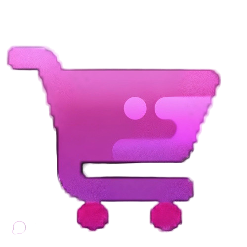

<div align="center">




<h1 align="center" >Spectrum Store</h1>


[](https://choosealicense.com/licenses/mit/)


  <p align="center">

  **Spectrum Store | A Robust E-commerce Platform Powered by Next.js, TypeScript, and Shadcn**

  **That leverages the [Fake Store API](https://fakestoreapi.com), It features an Admin dashboard and JWT auth.**
 Designed with a focus on security, it implements best practices for routing and server actions.
    <br />
    <br />
    <a href="https://issam-seghir.github.io/spectrum-store/">View Demo</a>
    .
    <a href="https://github.com/issam-seghir/spectrum-store/issues">Report Bug</a>
    .
    <a href="https://github.com/issam-seghir/spectrum-store/pulls">Request Feature</a>
  </p>

<br>
<hr>

</div>

<br>


### Built With

- 
- 
- 
- 
- 
- 
- 


## Getting Started

First, run the development server:

```bash
npm run dev
# or
yarn dev
# or
pnpm dev
# or
bun dev
```

Open [http://localhost:3000](http://localhost:3000) with your browser to see the result.

You can start editing the page by modifying `app/page.tsx`. The page auto-updates as you edit the file.

This project uses [`next/font`](https://nextjs.org/docs/basic-features/font-optimization) to automatically optimize and load Inter, a custom Google Font.

## Learn More

To learn more about Next.js, take a look at the following resources:

- [Next.js Documentation](https://nextjs.org/docs) - learn about Next.js features and API.
- [Learn Next.js](https://nextjs.org/learn) - an interactive Next.js tutorial.

You can check out [the Next.js GitHub repository](https://github.com/vercel/next.js/) - your feedback and contributions are welcome!

## Deploy on Vercel

The easiest way to deploy your Next.js app is to use the [Vercel Platform](https://vercel.com/new?utm_medium=default-template&filter=next.js&utm_source=create-next-app&utm_campaign=create-next-app-readme) from the creators of Next.js.

Check out our [Next.js deployment documentation](https://nextjs.org/docs/deployment) for more details.
